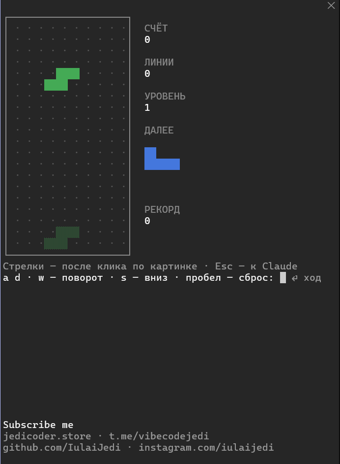

# vibe-arcade

English · [Русский](README.ru.md)

A Claude Code plugin that opens a game beside the transcript while Claude
works, and closes it by itself when Claude is done or needs your answer.



Three games:

- **Blocks** — falling pieces, clear the rows. The game pauses while the pane
  is closed and carries on from where you left it.
- **Tokensurfers** — a run down three tracks after tokens: jump the crate,
  slide under the beam, go around the wall. Tokens add up in a wallet.
- **Snake** — a walled field, apples, and a snake that speeds up as it grows.

The games are drawn with colored characters, so they run in any terminal on
any system: nothing is downloaded, there is no server, and nothing is sent
anywhere.

The text inside the games is in Russian; the keys are the same on any layout.

## Install

In Claude Code:

```
/plugin marketplace add IulaiJedi/vibe-arcade
/plugin install vibe-arcade@vibe-arcade
```

Requires Claude Code 2.1.287 or later.

## Usage

| Command | What it does |
| :- | :- |
| `/blocks` | turns the plugin on and opens Blocks |
| `/tokensurfers` | turns the plugin on and opens Tokensurfers |
| `/snake` | turns the plugin on and opens Snake |
| any of them with `off` | turns the plugin off |

Once on, it opens the pane by itself when Claude has been working for more
than 10 seconds, with the game you asked for last. When Claude finishes there
is a 3-2-1 countdown and the pane closes. If Claude needs you, say for a
permission prompt or a question, the pane closes at once and comes back after
you answer.

In a narrow terminal the pane does not open by itself: a line above the prompt
offers it instead — press `1`.

## Controls

Letters work as soon as the pane opens, on a Latin or a Russian layout.

| | Blocks | Tokensurfers | Snake |
| :- | :- | :- | :- |
| `a`, `d` | left, right | change track | left, right |
| `w` | rotate | jump | up |
| `s` | down | slide | down |
| space, Enter | drop | jump | new game |
| `r` | new game | — | new game |

Arrow keys work after you click the picture itself. A click anywhere else in
the pane gives the keys back to the letters. `Esc` returns to the prompt.

## Author

[jedicoder.store](https://jedicoder.store) ·
[Telegram](https://t.me/vibecodejedi) ·
[GitHub](https://github.com/IulaiJedi) ·
[Instagram](https://www.instagram.com/iulaijedi/)

## License

MIT. The open, count down and hand back flow is adapted from
[intermission](https://github.com/jarrodwatts/intermission) (MIT, Jarrod Watts).
